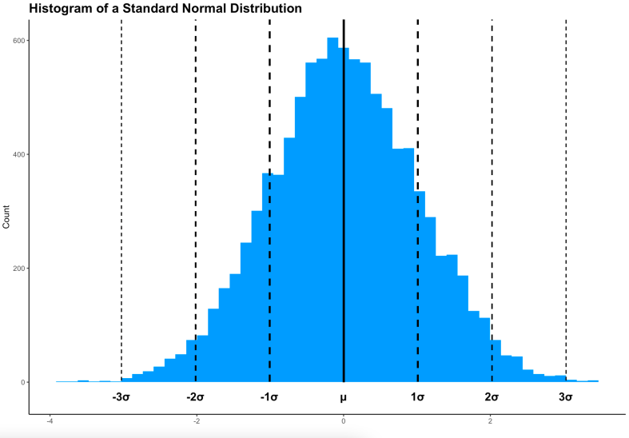

```{r setup, include = FALSE}
knitr::opts_chunk$set(echo = TRUE)  

library(here)
library(dplyr)
library(ggplot2)
library(gapminder) 

gm_eu <- gapminder %>%
  filter(continent == "Europe")
gm_eu
```

[How to make stunning histograms by Dario Radecic](https://www.r-bloggers.com/2021/11/how-to-make-stunning-histograms-in-r-a-complete-guide-with-ggplot2/)

This tutorial is from [Appsilon](https://appsilon.com/)


Although at first glance the histogram doesn't look like much, it actually tells you a lot. When data is distributed normally (bell curve), you can draw the following conclusions:

-   68.26% of the data points are located between -1 and +1 standard deviations (34.13% in either direction).\
-   95.44% of the data points are located between -2 and +2 standard deviations (47.72% in either direction).\
-   99.72% of the data points are located between -3 and +3 standard deviations (49.86% in either direction).
-   Anything outside the -3 and +3 standard deviation range is considered to be an outlier.

 


### GDP per capita in European countries between 1952 and 2007.   
```{r}
ggplot(gm_eu, aes(lifeExp)) +
  geom_histogram(color = "#000000", fill = "#0099F8")
```

### How to Style and Annotate ggplot Histograms
#### Styling
You can bring more life to your ggplot histogram. For example, we sometimes like to add a vertical line representing the mean, and two surrounding lines representing the range between -1 and +1 standard deviations from the mean. It’s a good idea to style the lines differently, just so your histogram isn’t confusing.

The following code snippet draws a black line at the mean, and dashed black lines at -1 and +1 standard deviation marks:  

```{r}
ggplot(gm_eu, aes(lifeExp)) +
  geom_histogram(color = "#000000", fill = "#0099F8") +
  geom_vline(aes(xintercept = mean(lifeExp)), color = "#000000", size = 1.25) +
  geom_vline(aes(xintercept = mean(lifeExp) + sd(lifeExp)), color = "#000000", size = 1, linetype = "dashed") +
  geom_vline(aes(xintercept = mean(lifeExp) - sd(lifeExp)), color = "#000000", size = 1, linetype = "dashed")
```

#### Combining histogram with a density plot.  
Are you up for a challenge? Try to recreate our histogram from Image 1. Hint: use geom_segment() instead of geom_vline().

Every so often you want to make your ggplot histogram richer by combining it with a density plot. It shows more or less the same information, just in a smoother format. Here’s how you can add a density plot overlay to your histogram:  

```{r}
 ggplot(gm_eu, aes(lifeExp)) +
  geom_histogram(aes(y = ..density..), color = "#000000", fill = "#0099F8") +
  geom_density(color = "#000000", fill = "#F85700", alpha = 0.6) 
```

It’s somewhat of a richer data representation than if you’d’ve gone with the histogram alone. For example, if you were to embed the above chart to a dashboard, you could let the user toggle the overlay for maximum customizability.v  

### Annotations
Finally, let’s see how you can add annotations to your ggplot histogram. Maybe you find vertical lines too intrusive, and you just want a plain textual representation of specific values.

First things first, you’ll need to **create a data.frame for annotations**. It should contain X and Y values, and also the labels that will be displayed:  

```{r}

annotations <- data.frame(
  x = c(round(min(gm_eu$lifeExp), 2), round(mean(gm_eu$lifeExp), 2), round(max(gm_eu$lifeExp), 2)),
  y = c(4, 52, 5),
  label = c("Min:", "Mean:", "Max:")
) 
```

You can now include the annotationsin a **geom_text() layer**. Hint: make the annotations bold, so they’re easier to spot:  

```{r}
ggplot(gm_eu, aes(lifeExp)) +
  geom_histogram(color = "#000000", fill = "#0099F8") +
  geom_text(data = annotations, aes(x = x, y = y, label = paste(label, x)), size = 5, fontface = "bold")
```

The trick with annotations is making sure there’s some gap between them, so the text doesn’t overlap.

Let’s also see how you can remove this grayish background color. The easiest approach is by adding a more minimalistic theme to the chart. The theme_classic() is one of our top picks: 

```{r}
ggplot(gm_eu, aes(lifeExp)) +
  geom_histogram(color = "#000000", fill = "#0099F8") +
  theme_classic() 
```

Add Text, Titles, Subtitles, Captions, and Axis Labels to ggplot Histograms
Titles and axis labels are mandatory for production-ready charts. Subtitles or captions are optional, but we’ll show you how to add them as well. The magic happens in the labs() layer. You can use it to specify the values for title, subtitle, caption, X-axis, and Y-axis:  

```{r}
ggplot(gm_eu, aes(lifeExp)) +
  geom_histogram(color = "#000000", fill = "#0099F8") +
  labs(
    title = "Histogram of Life Expectancy in Europe",
    subtitle = "Made by Appsilon",
    caption = "Source: Gapminder dataset",
    x = "Life expectancy",
    y = "Count"
  ) +
  theme_classic()
```

It’s a good start, but the newly added elements don’t stand out. You can change the font, color, size, among other things, in the theme() layer. Just make sure to include a custom theme layer like theme_classic() before you write your styles. These would get overridden otherwise:  

```{r}

ggplot(gm_eu, aes(lifeExp)) +
  geom_histogram(color = "#000000", fill = "#0099F8") +
  labs(
    title = "Histogram of Life Expectancy in Europe",
    subtitle = "Made by Appsilon",
    caption = "Source: Gapminder dataset",
    x = "Life expectancy",
    y = "Count"
  ) +
  theme_classic() +
  theme(
    plot.title = element_text(color = "#0099F8", size = 16, face = "bold"),
    plot.subtitle = element_text(size = 10, face = "bold"),
    plot.caption = element_text(face = "italic")
  )

```


It’s starting to shape up now. And it also matches the color palette of our ggplot histogram. We’ve covered everything needed to get you started visualizing your data distributions with histograms, so we’ll call it a day here. But there’s so much more you can do with your visualizations. Check out some of our Shiny demos to see where advanced level R programming can take your data visualizations.  

### Conclusion
Today you’ve learned what histograms are, why they are important for visualizing the distribution of continuous data, and how to make them appealing with R and the ggplot2 library. It’s enough to set you on the right track, and now it’s up to you to apply this knowledge to your datasets. We’re sure you can manage it.

At Appsilon, we’ve used histograms and the ggplot2 package in developing enterprise R Shiny dashboards for Fortune 500 companies. If R and R Shiny is something you have experience with, we might have a position ready for you.
